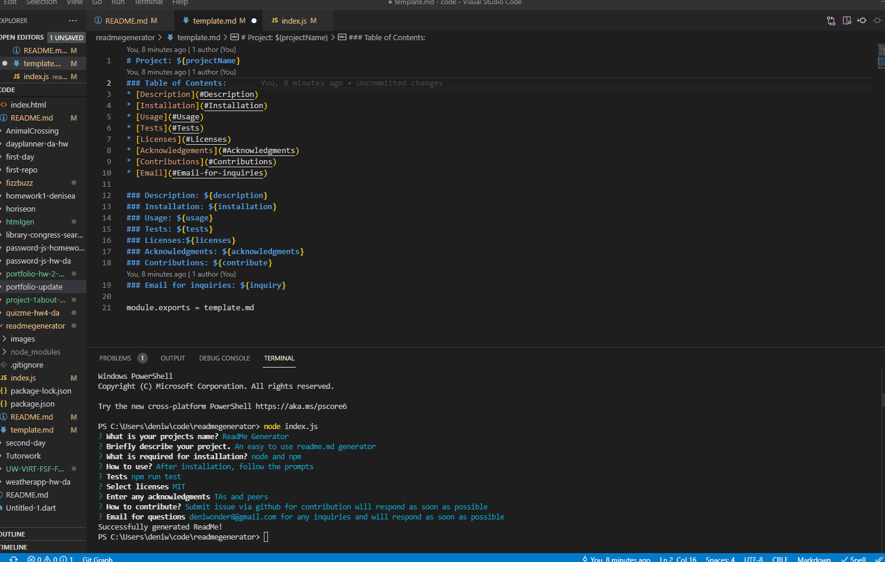

# readmegenerator
By answering a few questions this readme generator makes it easy to create a professional ReadMe markdown file. 

Installation:
Node.js and npm are required for functionality.
- Clone this repository
- Instal the npm modules by running npm install in terminal
- Answer the prompts via node index.js until successfully writing a new readMe file.

Please refer to the video for troubleshooting tips.

Usage:
In terminal navigate to directory and run node index.js follow the prompts and the user.md will be created.

Inquiry:
To contribute please create an issue in github and I will get to it as soon as possible or email me your request and or questions.
GitHub: https://github.com/denisearevalo
Email: deniwonder8@gmail.com

Demo:

